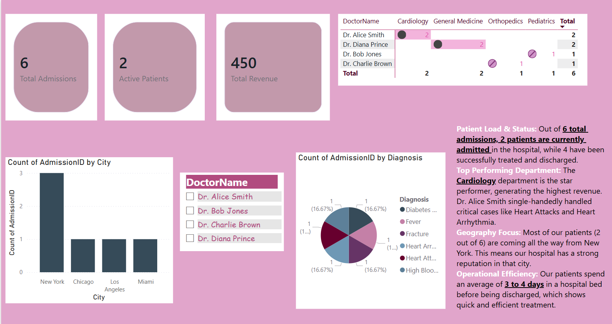

# 🏥 Hospital Management Data Analytics Project

An end-to-end data analytics project focused on database design and executive dashboard creation.

## 📊 Dashboard Preview

## 🛠️ Tools Used
* **Database:** MySQL Workbench (Relational Database Management)
* **Data Visualization:** Power BI Desktop
* **Language:** SQL & DAX

## 📂 Project Structure
* `hospital_database.sql`: Contains the SQL scripts to create tables (Patients, Doctors, Admissions) and mock data.
* `Hospital_Dashboard.pbix`: The complete Power BI dashboard file.

## 💡 Key Insights Captured
* **Total Admissions:** 6 | **Active Patients:** 2 | **Total Revenue:** $450
* **Top Department:** Cardiology generated the highest revenue, managed by Dr. Alice Smith.
* **Geography:** Maximum patient influx is from New York city.
